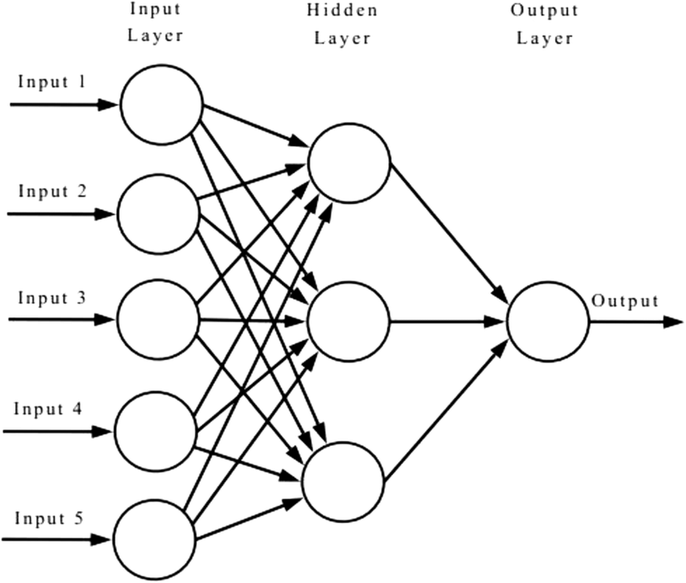
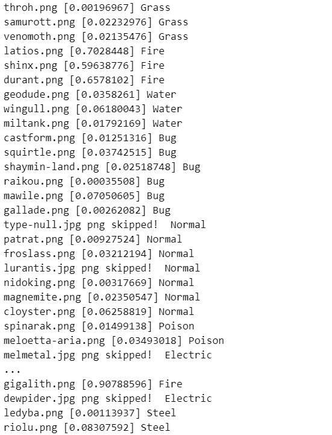

# Pokemon Classifier
Personal project implemented using Python.
The aim of this project is to detect whether a given pokemon is of fire type or not.
We are going to implement logistic regression from scratch to detect the chance of whether an image contains a fire type pokemon. 🔥

Image Credit - https://en.wikipedia.org/wiki/Pikachu

### What is Logistic Regression?

Image Credit - https://www.researchgate.net/figure/Schematic-form-of-single-layer-neural-network_fig4_338515920

Logistic regression can be viewed as a single-layer neural network using the sigmoid activation function. In logistic regression, the input features are multiplied by corresponding weights, summed up, and passed through the sigmoid function (also known as the logistic function). The sigmoid function maps the weighted sum to a probability value between 0 and 1, representing the predicted probability of belonging to a certain class. The parameters (weights) in logistic regression are typically learned through an optimization algorithm such as gradient descent to minimize the error between the predicted probabilities and the actual class labels.

More Info - https://en.wikipedia.org/wiki/Logistic_regression
### Get Started
Making use of jupyter framework. ✌

### Interepreting results
The below list example dipslays the probability of the pokemon being of a fire type along with its true type written next to it. Overall, the model performs allright but can be further improved using hyperparameter tuning.

